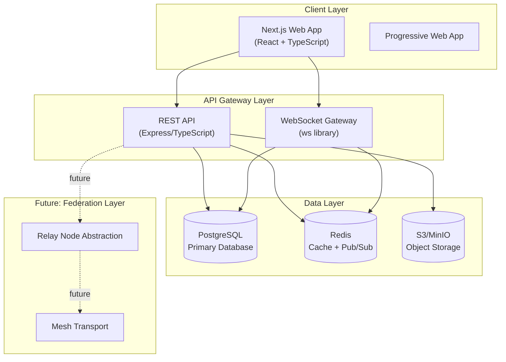
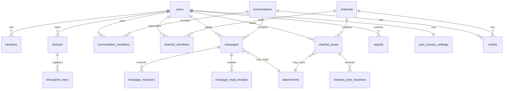
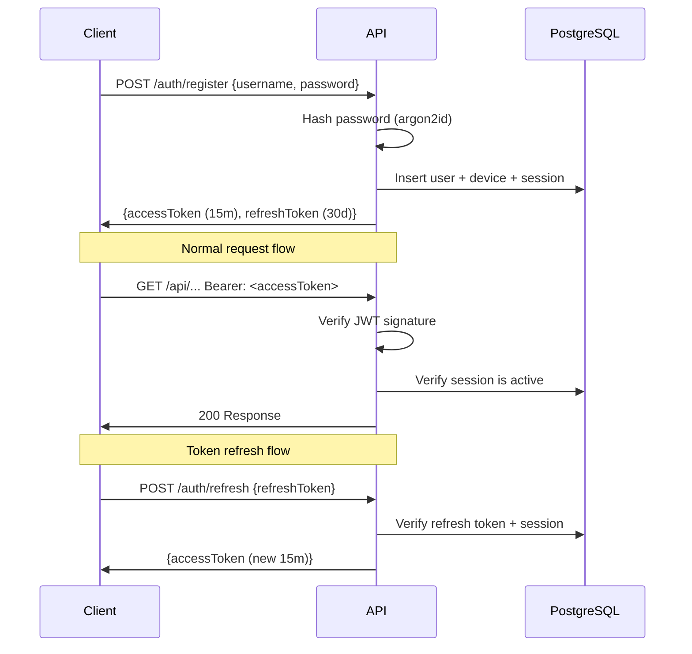
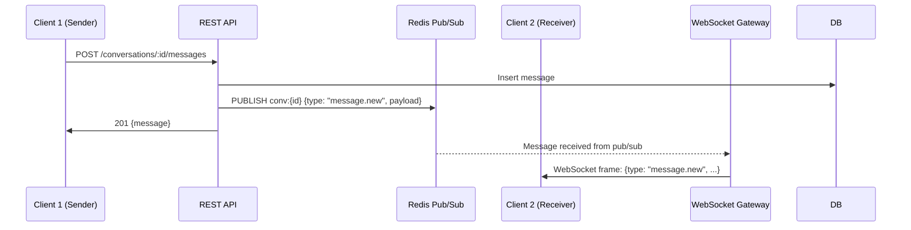
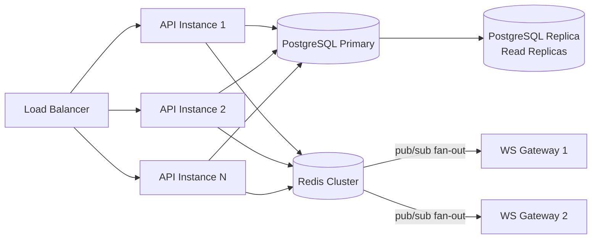

# PrivateMesh Architecture

## System Architecture Diagram

## Database Schema Diagram

## Authentication Flow

## WebSocket Event Flow

## E2EE Design (DM conversations)

For private one-to-one conversations, PrivateMesh implements a Signal Protocol-inspired design:

- Each device registers an identity key pair and pre-keys
- The server stores ONLY public key material (no private keys)
- Session keys are established client-side using X3DH key agreement
- Message content is encrypted client-side; server stores ciphertext only
- The `encrypted_content` field stores ciphertext when `is_encrypted=true`
- Server-managed group chat is acceptable for MVP; per-message E2EE is a roadmap item

**Trust assumptions:**
- The server cannot read E2EE message content
- The server can see metadata: who sent, when, conversation membership
- Users must verify device fingerprints out-of-band for strongest security

## Scaling Strategy

## Privacy Model

| Data Type | Visibility | Notes |
|-----------|-----------|-------|
| E2EE DM content | Client-only | Server stores ciphertext only |
| Group message content | Server-managed (MVP) | E2EE group planned for roadmap |
| Channel post content | Server-managed | Public channels indexed for search |
| Message metadata | Server operational | Who/when minimized; IPs not logged permanently |
| User profiles | Configurable per user | Privacy settings control visibility |
| Session data | 30-day retention | IP stored for security, not logged to analytics |
| Reports | 7-year retention | Legal compliance requirement |
| Moderation actions | Permanent | Legal/audit trail |

## Future Federation Architecture

The `relay_nodes` table and transport abstraction are designed to support:

1. **Self-hosting**: Deploy your own instance; users connect to it
2. **Federated relays**: Trusted relay nodes route messages between instances
3. **Mesh transport**: Intermittent connectivity via store-and-forward
4. **Node discovery**: Relay registry enables finding trusted nodes

This mirrors concepts from ActivityPub, Matrix, and Nostr but remains centralized-first for the MVP.
